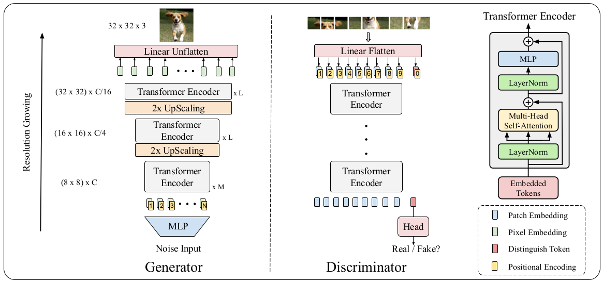
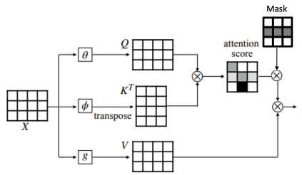
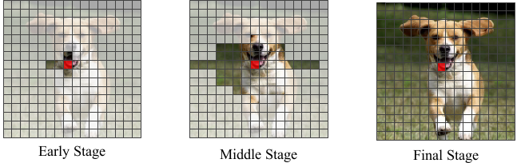

# Vision Transformer only GAN (Gen and Discr) - Pytorch

## 1. Related work:
	Original paper: Jiang, Yifan, Shiyu Chang, and Zhangyang Wang. "Transgan: Two transformers can make one strong gan." arXiv preprint arXiv:2102.07074 (2021). 
	
[TransGAN: Two Transformers Can Make One Strong GAN](https://arxiv.org/abs/2102.07074)
    
 Code inspired from [TransGAN](https://github.com/VITA-Group/TransGAN)

## 2. GAN Architecture


## 3. Self-attention masking


## 4. Gradually Increasing Receptive Field


## 5. Difference from original paper
- GELU activation is only approximated through:  to speed up computations done at GPU.

- MLP is formed by Fully Connected => GELU ==> Fully Connected => GELU 


## 6. Install requirements
```bash
pip install -r requirements.txt
```
Python version >= 3.6

## 7. Training
```bash
python train.py
```
	
## 8. Jupyter notebook
Use Untitled.ipynb to easily modify training parameters 

